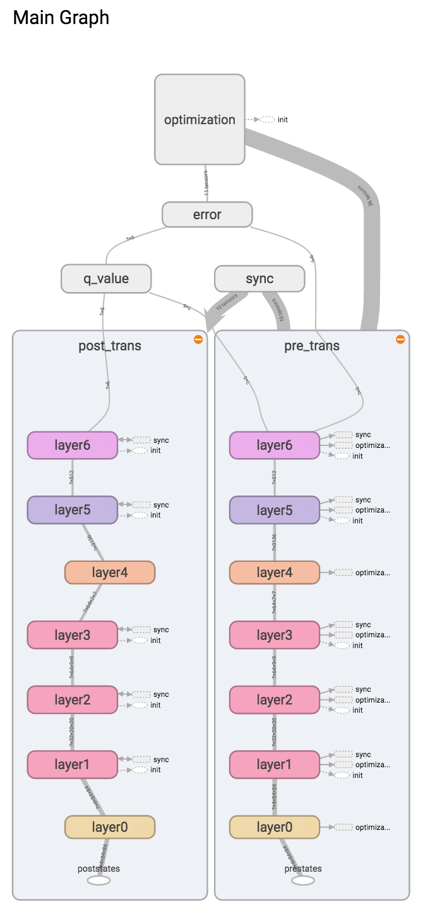

## Tensorflow Simple DQN

This is Tensorflow version of Simple DQN by tambetm.

For the detail of simple DQN, please refer [the original repositry](https://github.com/tambetm/simple_dqn/).



## Installation

You need to [install Tensorflow](https://www.tensorflow.org/versions/r0.9/get_started/os_setup.html) in addition to the original requirements.

## How to use

Training scripts and related commands should work without any modification.

For example, to train on GPU you can run: `./train.sh Breakout-v0 --environment gym --backend gpu`

If you want to run the original Neon version, change the `import` statements in `src/main.py` as follow.

```python
from deepqnetwork import DeepQNetwork  # instead of deepqnetwork_tf

from statistics import Statistics  # instead of statistics_tf
```

## Note

- Tensorflow version is not as fast as Neon Version. It is about 1.5 times slow.

## TODO

- Add tensorboard data
- Add trained weight
